<picture>
  <source media="(prefers-color-scheme: dark)" srcset="assets/banner-dark.svg">
  <source media="(prefers-color-scheme: light)" srcset="assets/banner-light.svg">
  
</picture>

I look for the place where an assumption stops holding, then write the proof
that it stopped. Most of that work is on machine-generated code: how it fails,
and how to build environments that check whether a model actually found a bug
instead of describing one.

### The banner is a real bug

`forge fmt` asserts internally that formatting a file twice gives the same
output, but the path the CLI takes skips that check. So I formatted 9,726
Solidity files from ten repositories twice and compared the two runs. Ten
diverged, which reduced to seven distinct causes. Two of them moved a comment
onto a different construct than the author had attached it to, which is the
kind of thing you only notice if you look.

[The report, one reduction per cause](https://github.com/foundry-rs/foundry/issues/17107)
· [Merged fix](https://github.com/foundry-rs/foundry/pull/17108)
· [All my PRs](https://github.com/pulls?q=is%3Apr+author%3ACalvinTjoaquinn+sort%3Aupdated-desc)

### What I maintain

| | |
|---|---|
| **[solexploit-gen](https://github.com/CalvinTjoaquinn/solexploit-gen)** | A generative smart-contract exploitation environment. A parametrized generator hides a Solidity vulnerability among decoys, the model writes an exploit, and the exploit runs on a bare anvil node where the reward is whether the protocol invariant actually broke. No LLM judge in the loop.    |
| **[virtio-fuzz-ci](https://github.com/CalvinTjoaquinn/virtio-fuzz-ci)** | Continuous fuzzing of the rust-vmm virtio parsers on GitHub-hosted runners, with the corpus cached between runs so coverage compounds instead of restarting every night.    |
| **[hallusec-replication](https://github.com/CalvinTjoaquinn/hallusec-replication)** | Replication package for *Detecting Security-Critical Code Hallucinations in LLM-Generated Code*.   |

### How I usually find things

Reading an issue tracker puts you in a queue behind everyone else reading the
same tracker. Using the tool puts you somewhere nobody is standing. Most of what
I send upstream starts from an invariant the project already believes about
itself, written down as a script that runs it against a large corpus.

If a patch of mine touches your project and you want it split differently or
backed by a regression test, say so on the PR and I will follow up.

Verifiable rewards for security tasks · virtio and hypervisor attack surface · LLM evaluation that resists contamination · Student, based in Indonesia
